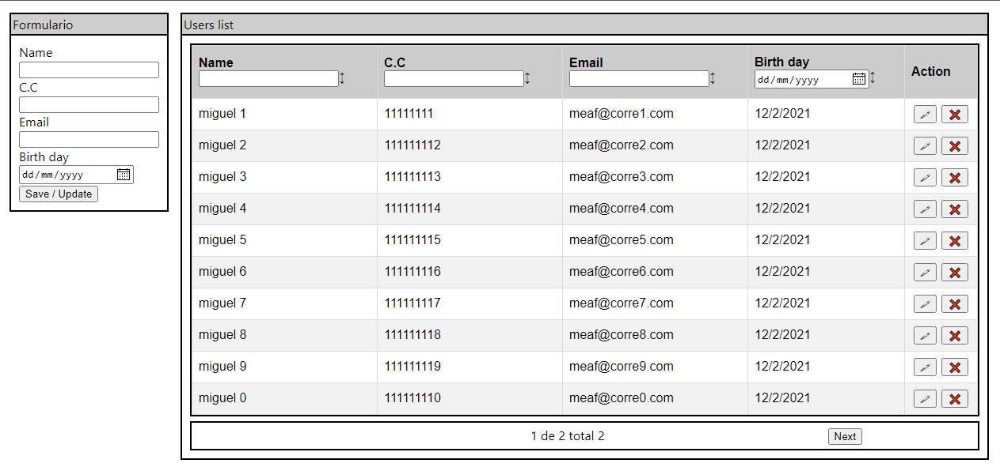

# EXPRESS - REACT - REDUX - MONGO - DOCKER
This is a working small example full stack project: 
- Dockerized working backend server made in express using mongodb 
- Dockerized working frontent client made in react js
- Full docker-compose up, backend-client-mongodb

# Description
This is an small project using EXPRESS - REACT - REDUX - MONGO - DOCKER, 
- You can add new users, update them from their c.c and also can be deleted,  you can find the endpoints at [CLIENT README.md](./client/README.md)
- You can filter and order users rows data with headers inputs and sort buttons
- Working pagination
- You can see the api available request at [Postman request.json](./requests.postman_collection.json)

# Considerations
- Make sure you have the mongodb service running in your machine, you can install it with the following guide [Mongodb manual installation](https://docs.mongodb.com/manual/installation/)
- Make sure you have the docker service running in your machine, you can install it with the following guide [Docker manual installation](https://docs.docker.com/get-docker/)
- Make sure you have docker-compose installed your machine, you can install it with the following guide [Docker-compose manual installation](https://docs.docker.com/compose/install/)

# Docker compose initialization
docker volume create --name=fullStackBackendDB

# Run docker compose
docker-compose up --build --d

# Docker compose considerations
- In the client the enviroment variables must start with "REACT_APP_" so thats why the client env variable of the host is named as "REACT_APP_API_ENDPOINT"
- At the backend service 

# Stack services information
- You can find more information about the backend service at [BACKEND README.md](./server/README.md)

- You can find more information about the client service at [CLIENT README.md](./client/README.md)